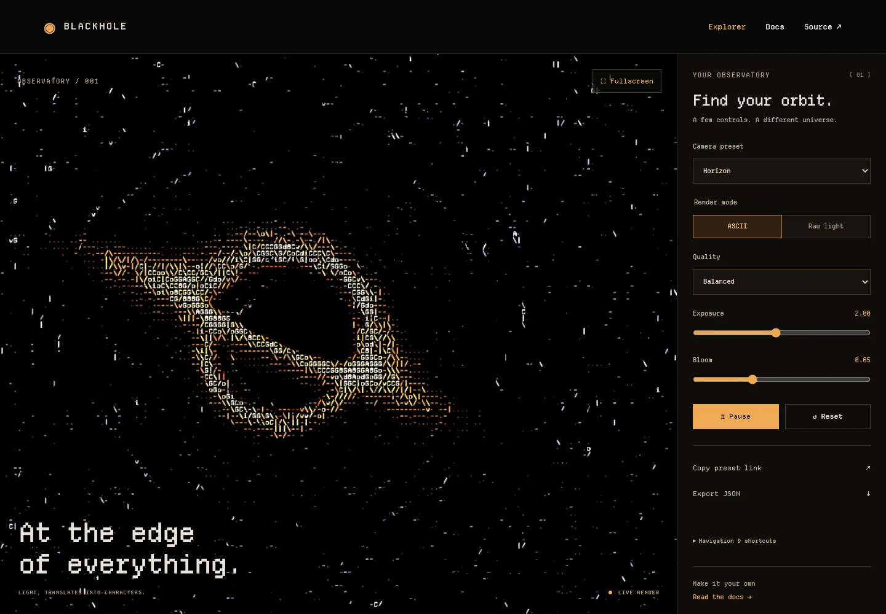

# Blackhole

An interactive black-hole renderer for browsers and terminals. Use it in a project, explore it on its own, or give your terminal an animated background.

[Explore in your browser](https://blackhole.austindelic.com) · [Documentation](https://blackhole.austindelic.com/docs/) · [Austin's portfolio](https://austindelic.com)

[](https://blackhole.austindelic.com/explore/)

## Try it

```sh
npx @austindelic/blackhole-cli explore
```

The native explorer uses Rust, wgpu, and Ratatui. Move with WASD, look with the arrow keys, and press `?` for controls. Node.js 22+ is required for the npm launcher. Native packages target macOS arm64/x64, Linux arm64/x64, and Windows x64; a compatible GPU is required.

## Use it on the web

```sh
npm install @austindelic/blackhole
```

```tsx
import { BlackHole } from '@austindelic/blackhole/react';

export function Scene() {
  return <BlackHole style={{ height: '70vh' }} asciiEnabled exposure={2} />;
}
```

The framework-neutral entry point does not require React:

```ts
import { mountBlackHole } from '@austindelic/blackhole';

const scene = mountBlackHole(document.querySelector('#scene')!, {
  asciiEnabled: true,
  exposure: 2,
});

await scene.ready;
scene.pause();
scene.resume();
// When removing the scene:
scene.dispose();
```

Give the host element a nonzero height. WebGL2 and WebGPU backends, camera controls, ASCII conversion, and quality presets are included.

### Own the source

```sh
npx @austindelic/blackhole-cli add --framework react --out-dir src/blackhole
```

This copies editable renderer and shader source into your project. It detects supported Vite/React and Astro/React projects; use `--framework vanilla` for the framework-neutral entry. Preview changes with `--dry-run`. Existing files are preserved unless you explicitly pass `--overwrite`.

## Rust and Ratatui

```sh
cargo add austindelic-blackhole austindelic-blackhole-ratatui
cargo install austindelic-blackhole-cli
blackhole
```

The renderer produces completed character frames in a GPU worker. The Ratatui widget draws those frames without initializing a GPU or waiting for rendering inside `Widget::render`. Shader assets are embedded; consumer builds do not need Node.js.

See the [renderer](crates/renderer/README.md), [Ratatui widget](crates/ratatui/README.md), and [native explorer](crates/cli/README.md) for examples and controls.

## Ghostty

```sh
npx @austindelic/blackhole-cli ghostty --out-dir ghostty
```

The command exports a readable animated background and prints configuration instructions. It does not change your active terminal configuration. Ghostty uses the canonical physical trace and Departure Mono ASCII glyphs through three ordered shader passes; see its [integration guide](integrations/ghostty/README.md).

## One source, several surfaces

- `packages/blackhole`: browser runtime, React component, canonical GLSL, and generated WGSL.
- `packages/cli`: editable-source installer and native explorer launcher.
- `crates`: GPU renderer, Ratatui widget, and terminal explorer.
- `apps/explorer`: public explorer and documentation website.
- `integrations/ghostty`: standalone terminal shader adaptation.

[Austin's portfolio](https://github.com/austindelic/portfolio) consumes the released libraries. Portfolio content and branding live in that separate repository.

## License and attribution

Blackhole is distributed under GPL-3.0-only. The shader derives from the credited NPGS project; bundled fonts retain their SIL Open Font License terms. Preserve the applicable source, license, and attribution notices when redistributing. See [LICENSE](LICENSE), [NOTICE.md](NOTICE.md), and the [source provenance record](release/provenance.json).
